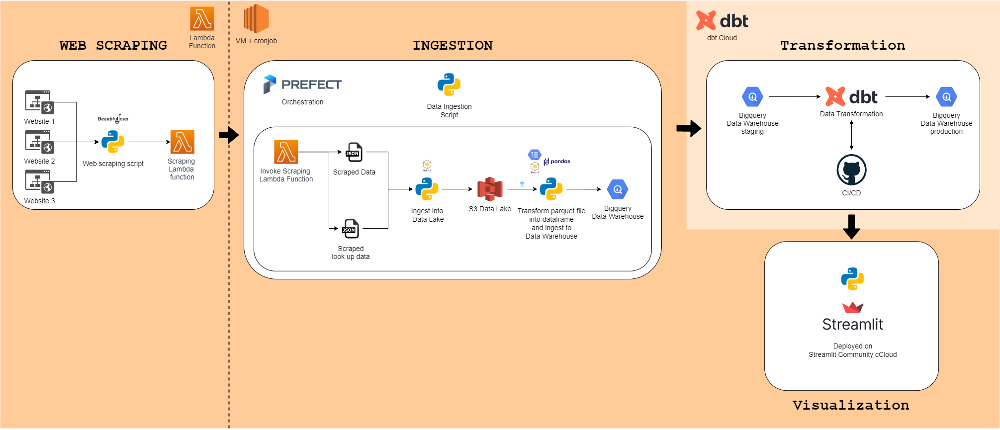

# Data Engineering Projects - ***Chess ELO***

## **Project Details**

The purpose of this particular project is to provide a comprehensive information about the top 10 chess player in the world (classical)

This is an end-to-end project that utilize the usage of multiple tools, from the gathering of the data, transforming it, and visualizing it. 

You can see the end result (visualization) [here](https://acothaha-chess-elo.streamlit.app/)

Main Page            |  Player Dashboard           | Head to Head                          |
:-------------------------:|:-------------------------: | :-------------------------:   |
  |    |     |

## **Project Datasets**

In this project, I work mainly with 2 datasets that i scraped from 2 sites.

- Chess player match data:

    This data consists of every single match that a player has played for their entire chess professional career

- Chess player information:

    This data consist of brief information of chess players.

## **Tools and Technologies**
- Python (beautiful soup, Pandas, AWS & GCP SDK, streamlit)
- HTML
- CSS
- AWS services (Lambda, S3, EC2)
- GCP services (BigQuery)
- Prefect 
- dbt
- ETL: Extract, Transform, Load Data
- Data Warehouse Concepts
- Data Modeling
- Cloud Computing Concepts
- Bash

## **Project Steps**

### **Step 1: Define scope of the project and necessary resources**

- Identify and search for data needed for the project. Determine the end use cases to prepare the data for (e.g., Analytics table, machine learning, etc.)
- initiate a cloud architecture (AWS, GCP, dbt, prefect) to be used for the project.

### **Step 2: Gather data (scraping)**

- Create a python script to scrape data from the chosen site(s)
- Put it into AWS Lambda so it can be run on cloud

### **Step 3: Explore and assess the data**

- Explore the data to identify data quality issues, like missing values, duplicate data, etc.
- data cleaning

### **Step 4: Define the data model**

- Mapping out the conceptual data model and explain why this model is used.
- planning to pipeline the data into the data model.

### **Step 5: Run ETL to model the data**

- Create the data pipelines and the data model
- Include a version control
- Run data quality checks to ensure the pipeline ran as expected.
- utilize orchestration as an attemp of monitoring the workflow
- Automate the process

### **Step 6: Visualization**

- Create a visualization according to the use case
- Deploy the visualization

